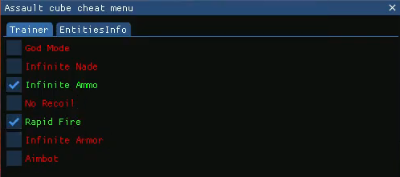

<a id="readme-top"></a>
![C][C++]

<!-- PROJECT LOGO -->
<br />
<div align="center">
    
  </a>

  <h3 align="center">Cheat Assault Cube</h3>

  <p align="center">
    This project is a cheat made in C++ for the game Assault Cube.
    <br />
    <a href="https://github.com/GregSourget/Cheat_AC_project/tree/main"><strong>Github Link</strong></a>
    <br />
    <br />
        <a href="https://youtu.be/63ukgap3N5w?si=AJJaBR9ziNtpK2fD">View Demo</a>
  </p>
</div>


<!-- TABLE OF CONTENTS -->
<details>
  <summary>Table of Contents</summary>
  <ol>
    <li>
      <a href="#about-the-project">About The Project</a>
      <ul>
        <li><a href="#built-with">Technologies Used</a></li>
      </ul>
    </li>
    <li>
      <a href="#getting-started">Getting Started</a>
      <ul>
        <li><a href="#prerequisites">Prerequisites</a></li>
        <li><a href="#installation">Installation</a></li>
      </ul>
    </li>
    <li><a href="#usage">Usage</a></li>
    <li><a href="#roadmap">Roadmap</a></li>
    <li><a href="#acknowledgments">Acknowledgments</a></li>
  </ol>
</details>


<!-- ABOUT THE PROJECT -->
## About The Project

This project was developed as part of a group assignment involving five students. The mission was to design and implement a cheat tool for the video game AssaultCube, an open-source first-person shooter.

The goal was to explore and apply various reverse-engineering techniques, memory manipulation, and game hacking strategies. This project focuses on demonstrating technical skills in C/C++ programming, memory scanning, and dynamic analysis in a controlled and educational context. 

<p align="right">(<a href="#readme-top">back to top</a>)</p>


### Technologies used

* ![C][C++]
* Cheat Engine
* Reclass
* x64 dbg

<p align="right">(<a href="#readme-top">back to top</a>)</p>

<!-- GETTING STARTED -->
## Getting Started

### Installation

_Follow the installation instructions to use the project._

1. Clone the repo
   ```sh
   git clone https://github.com/GregSourget/External_Cheat_AC_1.2.0.2
   ```


<p align="right">(<a href="#readme-top">back to top</a>)</p>


<!-- USAGE EXAMPLES -->
## Usage

1. Start *Assault Cube 1.2.0.2*
2. Open *cheat-menu.sln* file with Visual Studio 
3. Start the program in *Release* and *x86*

4. Click on the feature that you want to enable 


<p align="right">(<a href="#readme-top">back to top</a>)</p>


<!-- ROADMAP -->
## Roadmap

- [x] Add infinite nades
- [x] Add infinite health
- [x] Add ininite ammo
- [x] Add infinite shield
- [x] Add aimbot
- [x] Add no recoil
- [x] Add rapidfire
- [ ] Add speedhack
- [ ] Add ESP/wallhack
- [ ] Add fly

<p align="right">(<a href="#readme-top">back to top</a>)</p>

<!-- ACKNOWLEDGMENTS -->
## Acknowledgments

Here are some resources that have been very helpful for the project :

* [Youtube Channel : Guided Hacking](https://www.youtube.com/@GuidedHacking)
* [Website : Unknown cheats](https://www.unknowncheats.me/forum/index.php)

<p align="right">(<a href="#readme-top">back to top</a>)</p>

<!-- MARKDOWN LINKS & IMAGES -->
[C++]: https://camo.githubusercontent.com/3bdc50ac6a762e56c87577073851245673208669defe9447a30c70b196512d54/68747470733a2f2f696d672e736869656c64732e696f2f62616467652f432b2b2d536f6c7574696f6e732d626c75652e7376673f7374796c653d666c6174266c6f676f3d63253242253242
